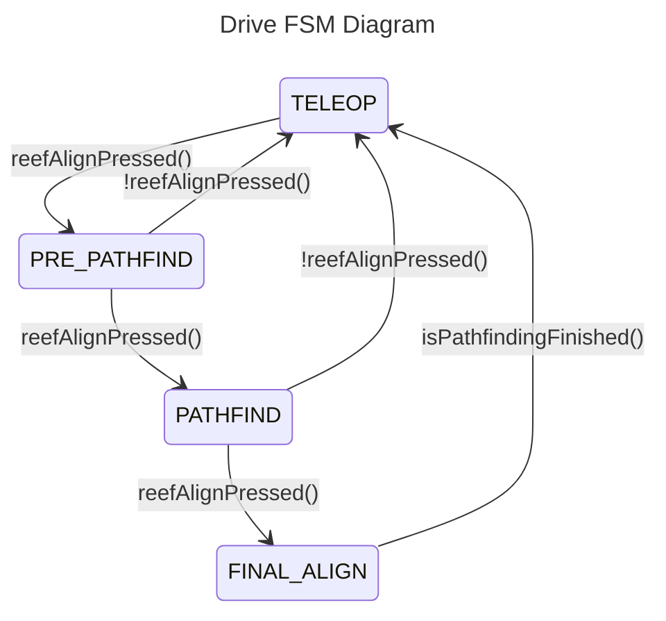

# Drive FSM Spec

```mermaid
---
title: Drive FSM Diagram
---
stateDiagram-v2
    state "TELEOP" as T
    state "PRE_PATHFIND" as PP
    state "PATHFIND" as P
    state "FINAL_ALIGN" as F
    T --> PP: reefAlignPressed() 
    PP --> P: reefAlignPressed()
    P --> F: reefAlignPressed()
    F --> T: isPathfindingFinished()
    P --> T: !reefAlignPressed()
    PP --> T: !reefAlignPressed()
```

### The default state for the DriveFSM is TELOP
